

  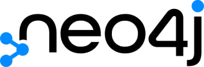

## Що таке Neo4j (графова база даних)?

Neo4j - це провідна графова база даних. Вона пропонується комерційно, повністю підтримується і є відкритим кодом. Створена в 2007 році,
Neo4j є NoSQL-базою даних на базі Java, не вимагає схеми та має широкі можливості масштабування.
Так що що таке Neo4j? Зазвичай її вважають найкращою на сьогоднішній день готовою до використання корпоративною графовою базою даних. 
Ми розглянемо графові бази даних, особливості та переваги Neo4j.

## Що таке графова база даних?

По суті, графові бази даних зберігають дані у формі графів. Граф - це математичний концепт, який класифікує елементи
за допомогою вершин (вузлів) та ребер (відносин), щоб зрозуміти зв'язки і закономірності в досліджуваній інформації.
При використанні графової бази даних, такої як Neo4j, ці графи часто представляються візуально.
Графові бази даних - це відносно новий клас баз даних, які використовуються для випадків, що особливо зосереджені на взаємозв'язках у даних.
Іншими словами, хоча графові бази даних зберігають дані у вигляді вузлів і ребер, вони більше зосереджені на зв'язках,
які часто приховані серед численних елементів у величезних обсягах даних. У графовій базі даних зв'язки є об'єктами першого класу разом із об'єктами даних.
Хоча Neo4j часто називається безсхемним, кращий термін - "схема за вибором", оскільки схема може використовуватися (хоча і не обов'язково).

  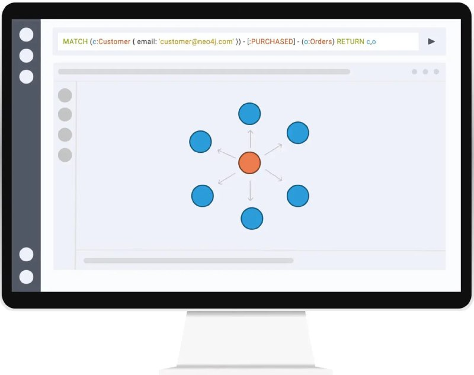

## Чому графові бази даних?

Найбільш фундаментальним аспектом графової бази даних для розуміння є структура даних, яку вона використовує для зберігання інформації - граф.

  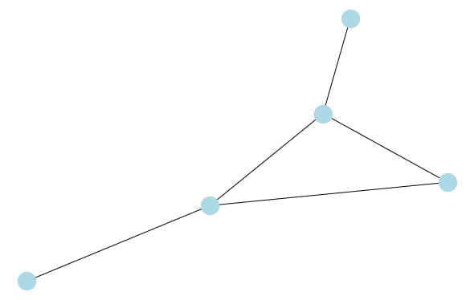

Графи, що складаються з набору вершин, з'єднаних відношеннями або ребрами, були фундаментальною структурою в комп'ютерних науках протягом десятиліть, а в математиці - протягом століть, завдяки своїй здатності більш оптимально описувати складність природних зв'язків у світі. Оскільки графи зберігають дані схоже до людського
мозку - пов'язуючи концепції через відносини між ними - вони пропонують більш інтуїтивне середовище для зберігання, аналізу та розуміння даних 
крізь призму цих зв'язків. Використовуючи цю реальність з власною базою даних, яка
враховує цей вроджений зв'язок у наших даних, графові бази даних можуть зберігати наші дані, на велику шкалу, з конкретним акцентом на збереження
унікально цінної та вроджено взаємопов'язаної інформації та шаблонів, які знаходяться всередині. Простий приклад нижче надає більше візуального розуміння цієї цінності.

## Як відрізняється графова база даних?

Розглянемо наступний традиційний табличний набір даних:

| Name   | Job          | Address        |
|--------|--------------|----------------|
| Sonya  | Pilot        | 101 N Main St  |
| Parker | Food Service | 101 N Main St  |
| Alex   | Pilot        | 455 West Ave   |

Для простого ведення записів та пошуку ця таблична структура з рядками та стовпцями працює досить добре (як у класичних системах керування реляційними базами даних,
таких як Microsoft SQL Server і MySQL і т.д.). Якщо ми задамо питання, наприклад, "Де живе Sonya?", то знайти відповідь просто. Ми просто робимо пошук по запису Sonya,
перевіряємо стовпець "Address", і отримуємо нашу відповідь. Однак, якщо ми задамо більш внутрішньо пов'язане питання, таке як "Хто ще живе за адресою Sonya?",
ми стикаємося з проблемою масштабування при спробі відповісти на ці питання за допомогою традиційних табличних форматів.

Для відповіді на це питання у табличній базі даних нам спочатку доведеться здійснити пошук по запису Sonya, як і раніше, зберегти її адресу,
а потім провести ще один пошук на основі цієї адреси, щоб отримати відповідь. І хоча це може здатися тривіальним доповненням в контексті такого простого прикладу, як цей,
подібні запитання на підприємницькому рівні можуть швидко зробити відповіді на ці критично важливі взаємопов'язані питання нереальними, особливо коли додаються
нові зв'язки та ставляться більш складні питання.

## Чи може це зробити RDBMS?

  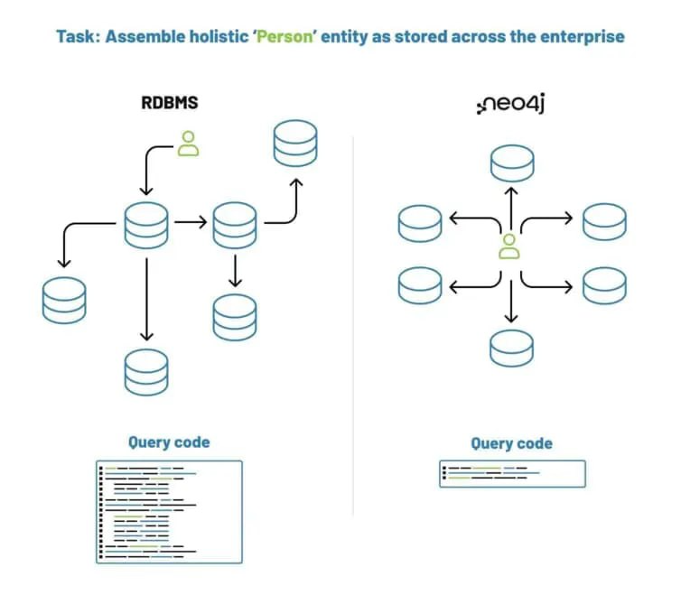

Маючи достатньо часу на розробку та обчислювальну потужність, RDBMS може робити багато речей, для яких вона не є ідеальною.
На відміну від графових баз даних, традиційні реляційні бази даних не зберігають зв'язки між наборами даних. 
Замість цього RDBMS зберігає лише самі дані. Він може вираховувати зв'язки лише під час виконання запитів.
Це вимагає великих обчислювальних ресурсів та часу, в той час як та сама інформація може бути отримана за милісекунди за допомогою простого графового запиту.
На практиці RDBMS не є оптимальними для багатьох випадків використання, тоді як Neo4j та інші графові бази даних чудово підходять для цих цілей.

## Приклад графової бази даних

Давайте розглянемо це з точки зору графа. Щоб структурувати ці дані як граф, ми просто виділяємо всі унікальні сутності у даних і розглядаємо їх як вузли:

  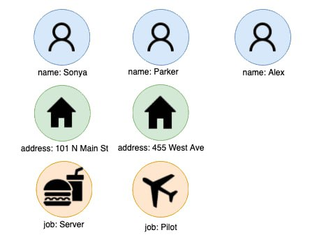

Іноді це так само просто, як зібрати унікальні значення з кожного стовпчика. Однак для менш структурованих даних, таких як рядкові адреси, електронні адреси або назви компаній,
цей процес може вимагати додаткової підготовки даних за допомогою процесу розпізнавання сутностей, який часто є одним з перших кроків, через які проходять користувачі, коли вперше працюють з графами.
Також, використовуючи сучасні методи обробки природної мови (NLP), графові бази даних є унікальним масштабованим інструментом для отримання потенційної цінності з величезної кількості неструктурованих даних на підприємстві (наприклад, відгуки клієнтів, текст у соціальних мережах, документація на продукцію, описи лістингів, внутрішні бази знань, зовнішнє законодавство тощо), які також є дуже взаємопов'язаними за своєю природою.

Після цього етапу виділення унікальних сутностей ми створюємо зв'язки або ребра між будь-якими вузлами, які мають спільний зв'язок з цим записом, вказуючи тип відносин між вузлами.
Це дозволяє нам не лише зберігати факт того, що два вузли пов'язані між собою, а й зберігати те, як вони пов'язані, що дозволяє детальніше враховувати зв'язний характер даних і виконувати складні операції, які раніше були неможливими, використовуючи інформацію, що зберігається в цих зв'язках. Такий граф виглядає наступним чином:

  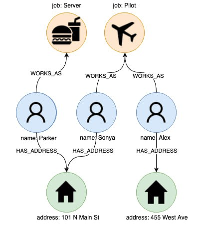

Тепер пригадаймо наше питання з раніше: "Хто ще живе за адресою Sonya?". Тепер, коли наші дані структуровані і зберігаються у вигляді графа, це питання дуже просте. Ми починаємо з пошуку запису, який нас цікавить, шукаючи вузол, що представляє Соню:

  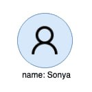

Після визначення місцезнаходження вузла, про який йде мова, знайти його запис адреси так само просто, як швидко пройтись по відношенню/синтаксису  HAS_ADDRESS:

  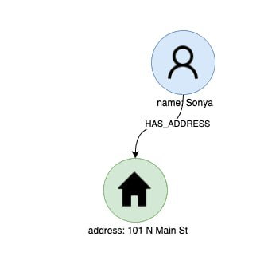

Тепер, щоб отримати остаточну відповідь на наше запитання, нам потрібно лише прослідкувати всі інші зв'язки HAS_ADDRESS, які пов'язані з адресним вузлом. Таким чином ми швидко знайдемо всі сусідні записи без необхідності додаткового пошуку, що зменшує час і складність нашого запиту.

  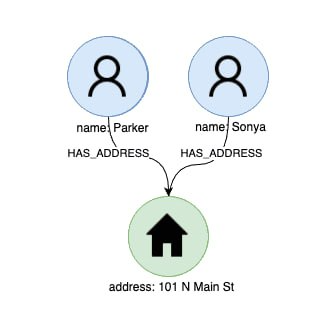

Використовуючи вроджену взаємопов'язаність графів як структури даних, ми можемо перейти від формулювання наших питань за допомогою серії витратних і часто складних
SQL-запитів по численних рядках і стовпцях збережених даних до простої серії обходів за допомогою якої-небудь мови графових запитів (наприклад, Cypher, Gremlin і т. д.)
через дані, суміжність яких слугує швидким шляхом для отримання відповідей на наші складні взаємопов'язані запитання.І хоча графи і теорія графів роками використовувалися математиками і комп'ютерними науковцями для вирішення низки взаємопов'язаних питань, подібних до цього, лише в останнє десятиліття ми побачили,
як ці потужні структури даних використовуються як основа спеціалізованих баз даних, які тепер забезпечують масштабоване зберігання та отримання взаємопов'язаних даних
у підприємствах.

## Що таке Cypher?

Cypher - це мова запитів Neo4j, яка значно спрощує доступ до Neo4j за допомогою декларативних виразів, дуже схожих на мову SQL. Вперше створена для Neo4j, а тепер заснована на русі openCypher з відкритим вихідним кодом, який Neo4j започаткував для стандартизації мови запитів графових баз даних. Вона використовує так званий синтаксис ASCII для запитів даних у графовій базі даних.

## Чим Neo4j Cypher схожий і чим відрізняється від SQL?

Як метод запиту даних з графової бази даних, мова запитів Neo4j Cypher має багато спільного з SQL і, так само як SQL, класифікується як декларативна, текстова, структурована мова запитів.
Оскільки обидві мови складаються з ключових слів, речень і виразів, включаючи функції та предикати, велика частина синтаксису буде здаватися знайомою (наприклад, p.ProductId = 3365, WHERE, ORDER BY, LIMIT, AND і т.д.).
Однак через те, що Neo4j Cypher призначена для вираження графових шаблонів, є також деякі важливі відмінності, які в першу чергу зумовлені тим, що Neo4j є безсхемною базою даних.

  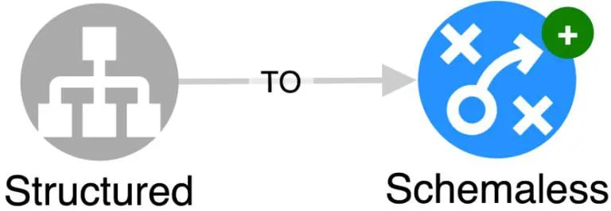

#### Безсхемні бази даних роблять перевірку результатів запитів ще важливішою.

Деякі з найважливіших відмінностей, що виникають з парадигми безсхемних баз даних, можна класифікувати у три основні групи, наведені нижче:

1.  **Запити Neo4j Cypher можуть посилатися на речі, які навіть не існують.** Порівняно з більшістю мов запитів, які видають помилку, якщо ви намагаєтеся звертатися до таблиці чи стовпця, які не існують у схемі,
    Neo4j Cypher цього не робить. Це може бути незручним через додаткові труднощі з налагодженням результатів. У SQL, якщо запит не повертає результатів, це означає, що немає даних, які відповідають вашому запиту.
    Проте в Neo4j Cypher це також може бути через неправильне написання (або відсутність)  Node Labels , Relationship Types або Property.
    Це тому, що Neo4j Cypher намагається зіставити шаблони, і якщо шаблон не існує, то нічого не повертається.

SQL:

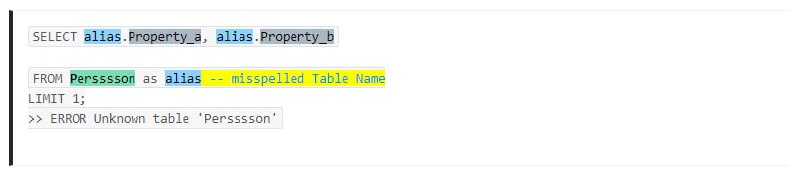

Cypher:

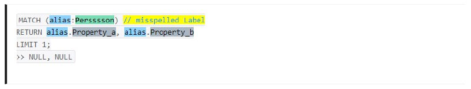

2.  **Синтаксис доступу до властивостей для неіснуючих властивостей такий самий, як і для властивостей без значень.**
Ось приклад Neo4j Cypher, який демонструє різну поведінку:

3. **Властивість Types, що зберігається у Nodes є цілком довільною.**

Наприклад, кілька вузлів із Label 'Person' можуть мати абсолютно різні властивості різних типів даних.
При запитуванні їх значення буде повернено, якщо воно існує, або NULL, якщо не встановлено чи не існує.

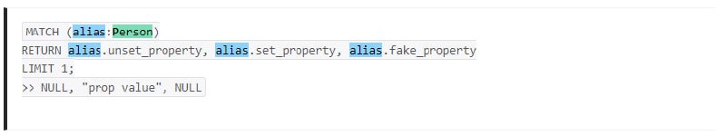

Повертає ці три властивості для кожного вузла, але типи даних можуть відрізнятися, і це може виглядати, наприклад, так:

4. **Управління відносинами в Cypher виконує цілком іншу функцію.**

У SQL, при з'єднанні двох таблиць дуже часто використовуються з'єднання типу LEFT/RIGHT, які визначають набір результатів, який ви шукаєте.
У Neo4j Cypher напрямки зв'язків засновані на зіставленні шаблонів.

Основна відмінність виникає з того факту, що вони не еквівалентні.

Не є тим самим, що і

Пропуск напрямку зв'язку менш ефективний, але поверне дані, де існує будь-який напрямок зв'язок.

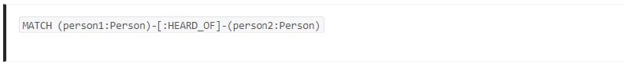

## Neo4j Cypher - мова графових запитів

Давайте почнемо на найвищому рівні з огляду структури графової бази даних, яка складається з **Nodes** та **Relationships** між ними.
Зазвичай вузли мають Labels, які використовуються для визначення їхнього типу. Можна, на рівні загальної концепції, уявляти один вузол
як один рядок даних, а мітку як назву таблиці. Мова запитів Cypher виражає це за допомогою символів, які вбудовані безпосередньо в синтаксис мови.
Це полегшує читання запиту, навіть для початківців.

  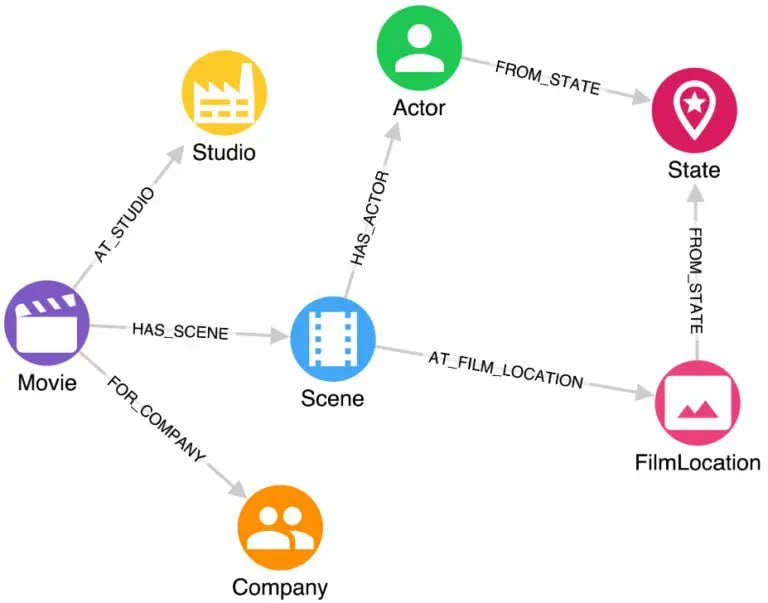

**Крок 1: ЗНАЙОМТСТВО З БАЗОВИМ СИНТАКСИСОМ**

Вузли оточені круглими дужками і містять Label та його  alias (псевдонімом) .

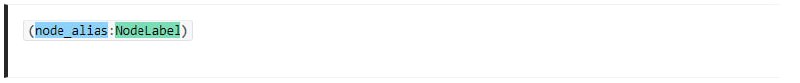

Відносини оточені квадратними дужками і містять  relationship Type  і його alias.

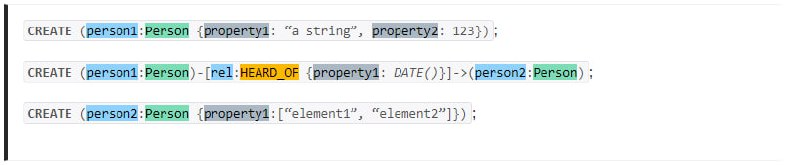

Вузли і зв'язки з'єднуються між собою за допомогою тире і символу більше/менше, щоб вказати напрямок relationship (зв'язку).

Інформацію можна зберігати на вузлах та зв'язках у формі Property, які представляють собою пари "ключ-значення".
Їх можна задати кількома різними способами.

При створенні Node/Relationship  можна використовувати фігурні дужки та двокрапки:

Як показано в цих прикладах Neo4j Cypher, Property можуть мати різні типи даних, такі як дати, рядки, числа і навіть масиви.

Властивості також можна встановлювати за допомогою команди SET, використовуючи точкову нотацію після створення вузла чи зв'язку:

**Крок 2: РОЗУМІННЯ КЛЮЧОВИХ КОМАНД NEO4HJ CYPHER**

Як і в будь-якій мові запитів, в Cypher існує багато команд у вигляді зарезервованих ключових слів та їх комбінацій для виконання різних дій.
Деякі з найпоширеніших у Cypher це **MATCH, CREATE, WHERE, SET, RETURN, WITH,**  які є найуживанішими.

**Крок 3: ЗНАЙОМСТВО З НАЙФУНДАМЕНТАЛЬНІШИМИ НАЙКРАЩИМИ ПРАКТИКАМИ СИНТАКСИСУ NEO4HJ CYPHER**

У контексті Neo4j інтерпретатору не важливо, як ви записуєте свій запит, якщо ви дотримуєтесь правильних шаблонів, таких як оточення вузлів ( ) та  зв'язків [ ], і т. д.

Однак, існують деякі найкращі практики синтаксису, які рекомендуються спільнотою, що допомагають досягти узгодженості та полегшують читання запиту.

1.  Node Labels у регістрі PascalCase
2.  Relationship Types у регістрі MACRO_CASE

Ці практики відповідають прийнятим у Java домовленостям щодо імен класів (вузол) і констант (зв'язки).

Конвенції для імен властивостей та псевдонімів вузла/відносини зазвичай залежать від фреймворку, у якому ви використовуєте запити. У Python більш поширеним є використання snake_case, тоді як у NodeJS нормою буде camelCase.

**Крок 4: РОЗУМІННЯ ЧУТЛИВОСТЫ NEO4HJ CYPHER ДО РЕГІСТРУ СИМВОЛІВ**

Це просто, але важливо: вузли, відносини, властивості та значення властивостей є чутливими до регістру, тільки ключові слова та команди не реагують на регістр.

Node з Label, наприклад, 'Person', є представником іншого класу, ніж a Node з Label 'person'. Те саме стосується зв'язків та їх Types.

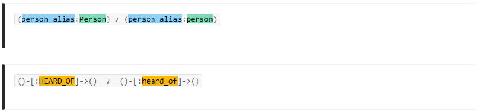

Навіть якщо обидві зазначені вище конструкції приймаються інтерпретатором, вони не еквівалентні і вказують на два різних типи  Nodes/Relationships. Ця логіка також відноситься до властивостей вузлів.

## Навіщо використовувати Cypher і Neo4j?

Це швидко. Коли справа доходить до відповідей на складні питання, які передбачають об'єднання багатьох традиційних таблиць разом, це дуже швидко. Запити, які зазвичай вимагають створення декількох "представлень", щоб прискорити час виконання запиту, стають непотрібними. 
Вона гнучка. Безсхематичність Neo4j робить можливим швидку розробку. Можливість повністю перепроектувати зв'язок між даними ПІСЛЯ завантаження всіх даних є неймовірно корисною.
Вона також проста для читання і написання. Ви можете скоротити кількість рядків запитів вдвічі. Ці переваги мають велике значення при розробці та підтримці програми або скрипта.

## Основні переваги Neo4j

<ul>
<li> <b>Cypher</b>. Звична SQL-подібна мова запитів</li>
<li> <b>LPG</b>. Модель графа властивостей з мітками</li>
<li> <b>Нативний граф</b>. Включає власне сховище графів та власний механізм обробки графів (GPE)</li>
<li> <b>Індексація за бажанням</b>. Безіндексна суміжність підвищує продуктивність; Neo4j також може використовувати індекси за допомогою Apache Lucence</li>
<li> <b>UNIQUE</b>. Підтримує обмеження UNIQUE</li>
<li> <b>Сильний користувальницький інтерфейс</b>. Neo4j Data Browser - це простий спосіб виконання команд Cypher</li>
<li> <b>Сумісність з ACID</b>. Цілісність бази даних Neo4j заснована на атомарності, узгодженості, ізоляції та довговічності</li>
<li> <b>Експорт</b>. Підтримує експорт в JSON та Excel</li>
<ul><li> <b>Доступ до API</b></li>
  <li> REST API доступний через будь-який засіб, що використовує протокол REST (наприклад, Java, Spring тощо)</li>
  <li>Доступ до JavaScript через будь-який фреймворк UI MVC (наприклад, Node JS)</li>
  <li>Java з двома API: нативний Java API та Cypher API</li>
</ul>
<li> <b>Шардинг</b>. Шардинг Neo4j - це їхня вдосконалена пропозиція починаючи з версії 4.0</li>
</ul>

## Для чого використовується Neo4j?

Хоча Neo4j можна використовувати для більшості сценаріїв використання, її унікальна цінність стає очевидною для сценаріїв використання, які зосереджені на зв'язках всередині даних. Деякі з найпоширеніших варіантів використання включають:
* Механізми рекомендацій, включаючи рекомендації в реальному часі
* Боротьба з відмиванням грошей (AML), податковим шахрайством
* Штучний інтелект на основі графів / машинне навчання (GPML)
* Управління основними даними (MDM)
* Управління ідентифікацією та доступом
* Графічна аналітика та алгоритми
* Мережеві та ІТ-операції
* Internet of Things (IoT)
* Графи знань
* Виявлення шахрайства

Всі ці варіанти використання стосуються того, як речі пов'язані з іншими речами, як люди пов'язані з іншими людьми або іншими сутностями в даних.

## Висновки

Neo4j - це графова база даних, яка вирізняється своєю здатністю ефективно зберігати та обробляти дані в графовій структурі. Завдяки гнучкості графової моделі, Neo4j відповідає вимогам сучасних систем, де важливий аспект - це взаємодія та зв'язки між об'єктами.

Однією з ключових переваг Neo4j є здатність нативно виражати та оптимально опрацьовувати складні взаємозв'язки великого обсягу даних. Це дозволяє отримувати аналітичні висновки та нові знання, які можуть мати значущий вплив на бізнесові та дослідницькі проекти.

Завдяки мові запитів Cypher та вбудованим механізмам транзакцій, Neo4j забезпечує зручний інтерфейс для роботи з базою даних. Його використання стає особливо ефективним у сценаріях, де ключовий акцент робиться на взаємозв'язках у даних, таких як соціальні мережі, системи рекомендацій, логістика та багато інших галузей.

Загалом, Neo4j виступає як потужний інструмент для зберігання та аналізу графових даних, надаючи можливості вивчення взаємозв'язків у великому масштабі та допомагаючи в розв'язанні складних завдань в області обробки інформації.

